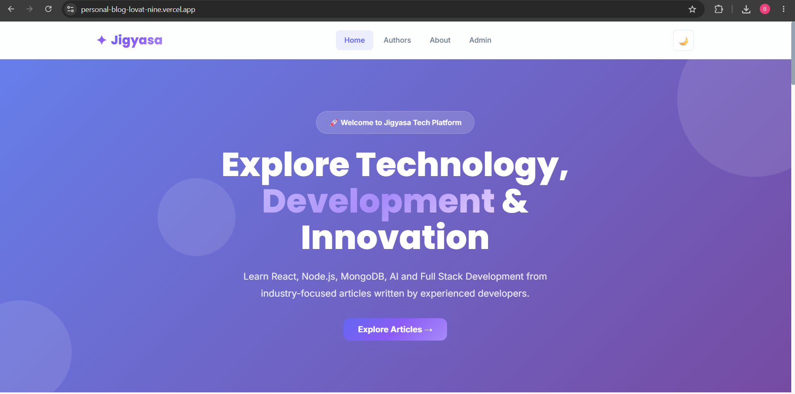
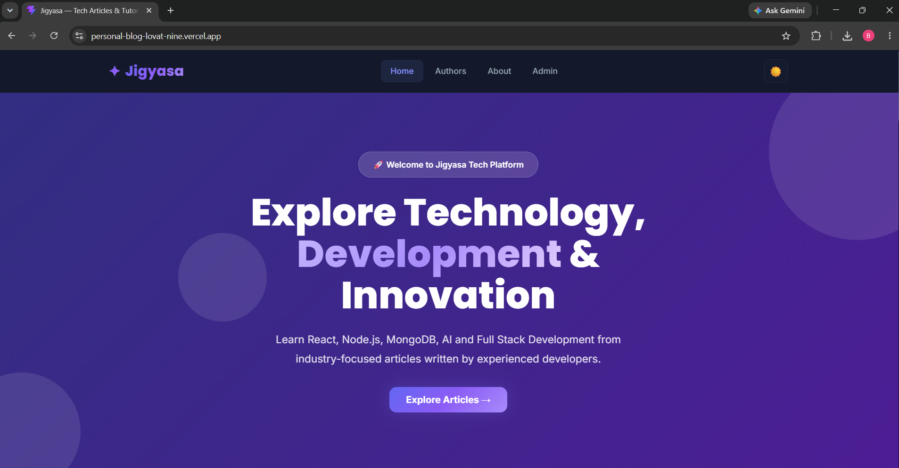

# Personal Blog Platform

## Project Overview

Briefly describe the Personal Blog Platform and its purpose.

## Features
    Article Management
    Admin Dashboard
    Authentication (JWT)
    Comments
    Analytics Dashboard
    Image Upload
    SEO Optimization
    Responsive Design
    Dark Mode

## Tech Stack
    # Frontend
        React.js
        React Router
    # Backend
        Axios
        React Markdown
        React Helmet Async
    # Backend
        Node.js
        Express.js
    # Databases
        MongoDB Atlas
        Aiven MySQL
    # Cloud Services
        Render
        Vercel
        Cloudinary

## Live URLs

    Frontend:

        https://personal-blog-lovat-nine.vercel.app

    Backend:

        https://personal-blog-api-2yiy.onrender.com

# Screenshots

## Home Page (Light Mode)

## Home Page (Dark Mode)

